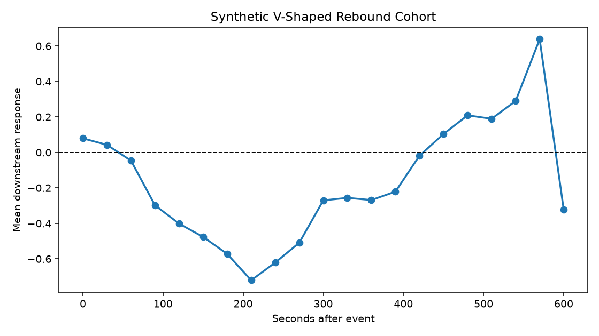

# Causal Event-Pipeline Demo


A compact, self-contained methodology demo for building **causal event-data pipelines** from asynchronous, market-data-like feeds. It shows how to assemble ordered event tapes from two out-of-sync sources, strictly separate pre-event from post-event information, run no-lookahead validation, evaluate a model under embargoed temporal cross-validation with bootstrap confidence intervals, and freeze every run with content checksums into an auditable report.

The repository uses **synthetic data only**. It contains no raw data, no venue-specific configuration, no execution logic, no private features, and no operational strategy. It demonstrates *how the pipeline is built and validated*, not a predictive result: the model stage is an evaluation scaffold, and any metric it prints is a run artefact rather than a performance claim.

## What The Demo Shows

- deterministic synthetic generation of two asynchronous feeds;
- a normalised, chronologically ordered event tape;
- ASOF alignment that only ever attaches past-or-current observations;
- strict pre-entry / post-entry separation, so features describe what was knowable *before* each event and outcomes describe what happened *after*;
- causal feature generation and mechanism-based cohort analysis;
- a V-shaped rebound pattern surfaced from post-event trajectories;
- **embargoed temporal cross-validation** with a **bootstrap confidence interval** on fold AUC;
- structured JSONL logging;
- hash-based run freezing and an auditable final report.

## Install

```bash
python -m pip install -e ".[test,lightgbm]"
```

Minimal install without the test tooling or the optional model:

```bash
python -m pip install -e .
```

## Run

```bash
make demo
# or
python -m causal_pipeline.cli run --config configs/demo.yaml
```

Each run creates a fresh directory under `runs/<run_id>/` holding logs, the frozen manifest, raw/interim/feature data, markdown and CSV reports, and figures.

## Test

```bash
make test        # ruff + pytest
# or
pytest
```

## Pipeline

```text
synthetic feeds
  -> normalised event tape
  -> ASOF alignment (past-or-current only)
  -> pre-entry tape ──► causal features ─┐
  -> post-entry tape ─► trajectories ────┤
                                         ▼
                          mechanism cohorts
                                         ▼
        embargoed temporal CV + bootstrap CI
                                         ▼
                          frozen run report
```

## Sample Output

The `rebound` cohort is synthetic by construction and gives the trajectory analysis an interpretable signal to inspect:



The evaluation scaffold reports per-fold AUC under embargoed temporal cross-validation, where each fold trains only on rows strictly earlier than its test block and an embargo gap is withheld so no time-adjacent row leaks into training. A representative run (`docs/assets/sample_demo_report.md`):

```text
- fold 0: train_rows=42,  test_rows=44, embargo_rows=2, auc=0.484
- fold 1: train_rows=86,  test_rows=44, embargo_rows=2, auc=0.498
- fold 2: train_rows=130, test_rows=44, embargo_rows=2, auc=0.548
- fold 3: train_rows=174, test_rows=44, embargo_rows=2, auc=0.652

Fold AUC bootstrap 95% CI: mean=0.546, lower=0.495, upper=0.614 (n_folds=4)
```

The planted pre-entry signal is faint, and the machinery reports it honestly: AUC improves as the training window grows, and the bootstrap interval sits just above chance at its lower bound. Detecting a weak signal *and quantifying the uncertainty around it* is the point — not a headline number.

## Validation Summary

The demo checks schema contracts, timestamp ordering, duplicate event identifiers, ASOF no-lookahead alignment, pre/post separation, temporal train/test splitting, embargoed fold construction, and checksum integrity for key artefacts. See [`docs/methodology.md`](docs/methodology.md), [`docs/validation.md`](docs/validation.md), and [`docs/limitations.md`](docs/limitations.md).

## Limitations

This is a simplified public demo built on synthetic data only. It has no venue-specific integrations, no real thresholds or private features, and is not deployable. The model is illustrative and exists to exercise the evaluation workflow; it is not the point of the repository.
